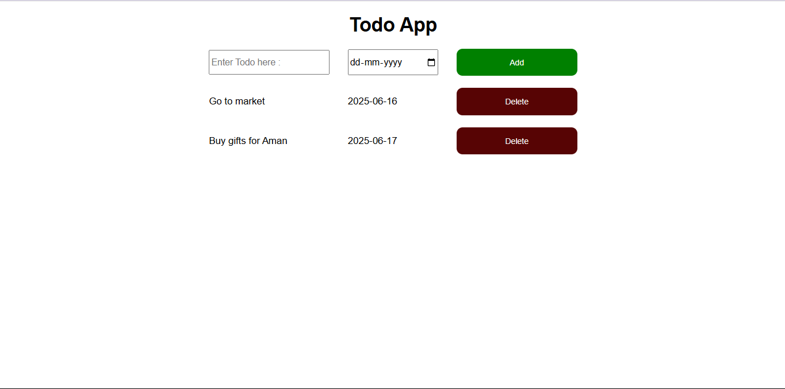

# Todo List App

A simple Todo app built using HTML, CSS, and JavaScript.  
It lets users add tasks with due dates and delete them.

## 🔧 Features
- Add tasks with a due date
- Delete tasks
- Clean UI

## 💻 Preview
 

## 🛠 Tech Used
- HTML
- CSS
- JavaScript

## 🚀 How to Run
Just open `index.html` in any browser.

---

Made by Vikash
